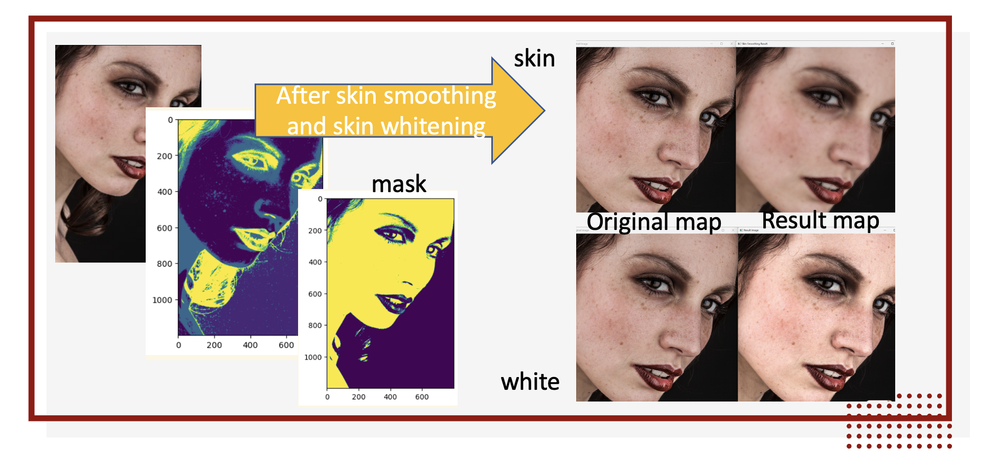
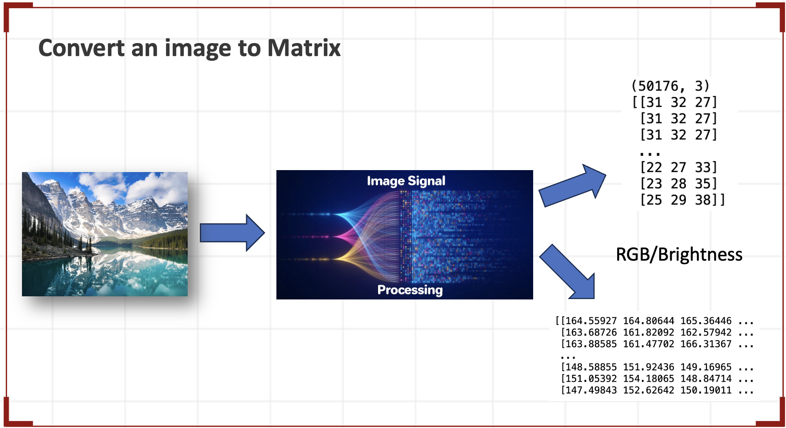

# Beauty-Camera: Image Data Clustering and Enhancement

## Introduction

Image data is an important type of data that can be processed in various ways. This project focuses on using clustering algorithms to extract information from image data. We employ three types of clustering algorithms: DBSCAN, K-Means++, and Gaussian Mixture Model, which represent density-based, distance-based, and probability-based clustering methods respectively. Based on the clustering results, we implement weight gain, character refinement, and skin smoothing and whitening operations on the image data.



## Clustering Algorithms



### DBSCAN
- **Type**: Density-based
- **Description**: DBSCAN (Density-Based Spatial Clustering of Applications with Noise) groups together points that are closely packed together, marking as outliers points that lie alone in low-density regions.

### K-Means++
- **Type**: Distance-based
- **Description**: K-Means++ is an improvement over the standard K-Means algorithm, providing a better initial seeding for the clusters, which leads to faster convergence and better results.

### Gaussian Mixture Model (GMM)
- **Type**: Probability-based
- **Description**: GMM is a probabilistic model that assumes all the data points are generated from a mixture of a finite number of Gaussian distributions with unknown parameters.

## Operations Based on Clustering Results

- **Weight Gain**: Enhancing certain features of the image based on clustering results.
- **Character Refinement**: Improving the clarity and definition of characters in the image.
- **Skin Smoothing and Whitening**: Enhancing the appearance of skin in the image by smoothing textures and adjusting color tones.

## Metrics

We use the Silhouette Coefficient as the metric to evaluate the performance of our clustering algorithms. However, we find that it does not correlate well with the performance of the operations implemented on the image data.

## Shortcomings and Future Work

Through this project, we have identified some shortcomings in each type of clustering algorithm. In the future, we aim to conduct deeper research on these algorithms and enhance their performance to better suit our needs.

## Installation

1. Clone the repository:
    ```bash
    git clone https://github.com/yourusername/image-data-clustering.git
    ```

2. Navigate to the project directory:
    ```bash
    cd image-data-clustering
    ```

3. Install required dependencies:
    ```bash
    pip install -r requirements.txt
    ```

## Usage

- Run the main script to perform clustering and enhancement operations on image data:
    ```bash
    python main.py
    ```

## Results

- The project provides insights into the effectiveness of different clustering algorithms for image data processing and enhancement.

## Contributing

- Contributions are welcome! Please submit a pull request or open an issue for any suggestions or improvements.

## License

- This project is licensed under the MIT License.
